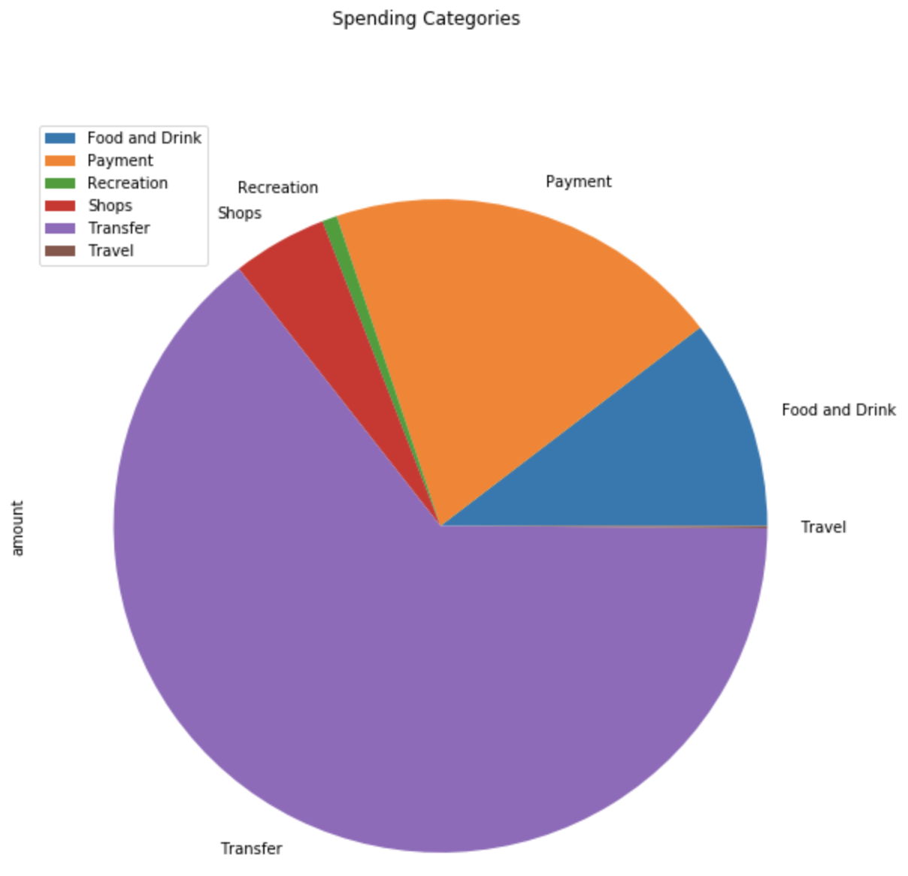
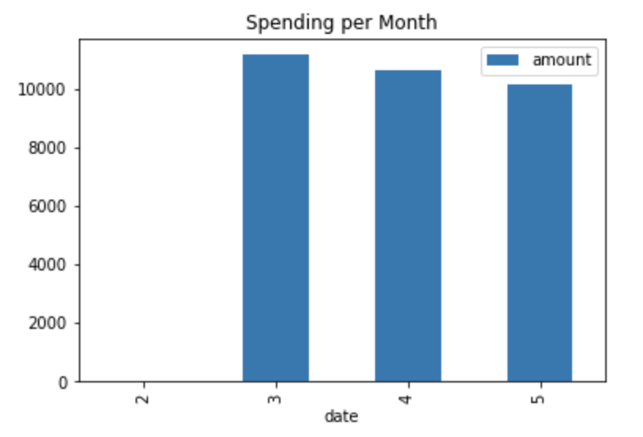
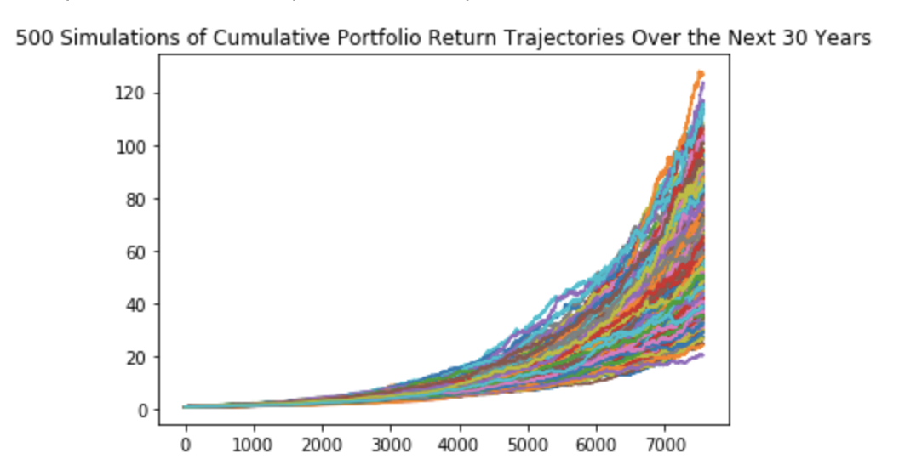
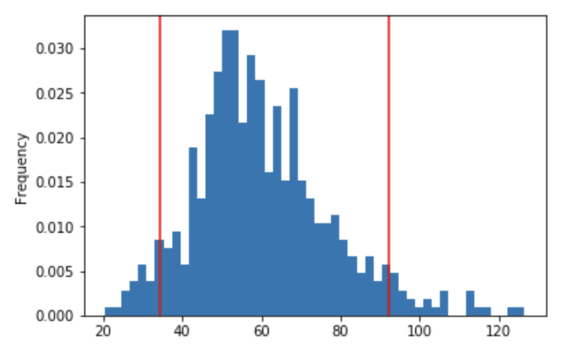

# Retirement Analysis Using APIs
This document summarizes Assumptions and Findings for Retirement Planning. Plaid and Alpaca APIs were used as data sources.
---
### Assumptions

* The transaction sample size was for the 90-day period from 2/28/2020 to 5/25/2020 using Plaid data
* The Monte Carlo simulation analysis is based on 2019 daily return data for a weighted portfolio of SPY (representing stocks with a weighting of 60%) and AGG (representing bonds with a weighting of 40%) using Alpaca data
* 500 Monte Carlo Simulations were run for a 30-year period of returns
---
## Findings
The following income data was provided by Plaid:
### Income:
* The previous year's gross income was $7,285.

* The monthly income is: $500.

* The projected yearly gross income is: $7,389.

### Expenses by Category 
* Food and Drink: $3,317.19
* Payment: $6,310.50
* Recreation: $235.50
* Shops: $1,500.00
* Transfer: $20,537.34
* Travel: $35.19

### Expenses per Month
* February: $6.33
* March: $11,145.24
* April: $10,645.24
* May: $10,138.91 

---
## Retirement Analysis
Running 500 Monte Carlo simulations produces the following range of cumulative  portfolio returns:

* The expected cumulative return for the 10th percentile is 41.26.
* The expected cumulative return for the 50th percentile is 57.74.
* The expected cumulative return for the 90th percentile is 82.33.

With a 90% confidence interval, expected cumulative returns will fall between the values of 34.496951 and 92.235803, denoted by the red vertical lines in the histogram above.

With an initial investment of $20,000:
* The expected portfolio return for the 10th percentile is $825,232.57.
* The expected portfolio return for the 50th percentile is $1,154,758.94.
* The expected portfolio return for the 90th percentile is $1,646,564.34.

Given the current projected annual income from the Plaid analysis, a 4% withdrawal rate from the retirement portfolio will result in $33,009.30 in retirement income which is sufficient.

By increasing the initial investment amount by 50%, a 4% withdrawal rate from the retirement portfolio will result in $49,513.95 in retirement income which is also sufficient.